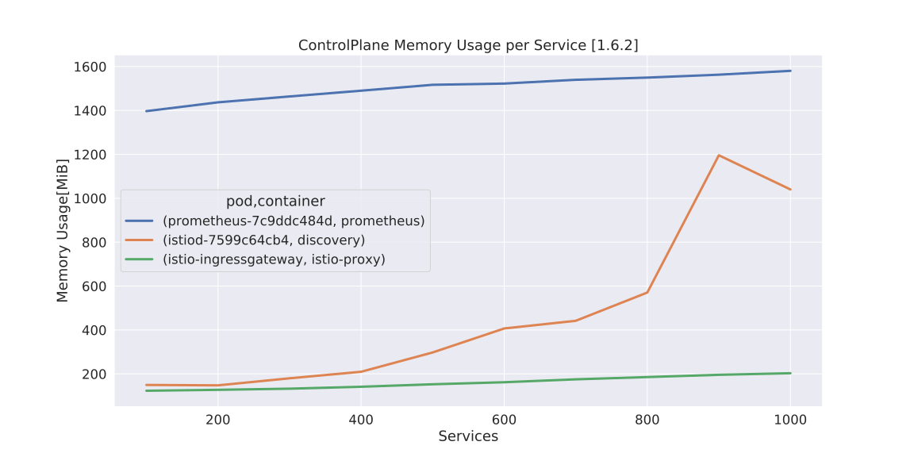

# istio-bench

A benchmark tool for [Istio](https://github.com/istio/istio). It measures CPU, Memory, Network usage of istio-proxies and istio control planes per number of pod.

This script will repeat deploying dummy pods and collect the usage of resources. Then it will calculate an approximate curve for resource usage and output csv tables and charts. Its architecture is shown as follows.


## Sample Results




See all samples [here](./output_sample/report.md).

## Prerequirements

- in local machine
    - Python >= 3.5.0
    - pip
    - kubectl >= 1.9.0
- in remote cluster
    - Kubernetes Cluster >= 1.9.0 (enough compute resources are recommended)
    - Istio > 1.2 installed in istio-system Namespace
    - Prometheus installed in istio-system Namespace

## Get Started

Install istio-bench

```sh
git clone https://github.com/Hitachi/istio-bench
cd istio-bench
pip install -r requirements.txt
```

And run it

```sh
./istio-bench.py
```

## Command line arguments

```txt
usage: istio-bench.py [-h] [--by number] [--prometheus url] [--namespace file] [--deployment file]
                      [--service file] [--no-chart] [--no-predict] [-o dir] [--isolate]
                      [--verbose {0,1,2,3,4}] [-V]
                      services

measures cpu, memory, and network usage of Istio for each service

positional arguments:
  services               number of services to be deployed as a workload

optional arguments:
  -h, --help             show this help message and exit
  --by number            number of Services by namespace (default: 100)
  --prometheus url       url of Prometheus. The default url uses kubectl port-forward (default:
                         http://127.0.0.1:9090)
  --namespace file       path of Namespace template file (default: ./template/namespace.yaml)
  --deployment file      path of Deployment template file (default: ./template/deployment.yaml)
  --service file         path of Service template file (default: ./template/service.yaml)
  --no-chart             do not output chart image(svg) (default: False)
  --no-predict           do not predict resource usage (default: False)
  -o dir, --output dir   path of the output directory (default: ./output-istio-{version}-{unixepoch})
  --isolate              [NOT IMPLEMENTED] isolate envoy xDS by namespace (default: False)
  --verbose {0,1,2,3,4}  number for the log level verbosity (default: 0)
  -V, --version          show program's version number and exit```
```

## Examples for usage and output

Measure the transition of resource usage when deploying 250 dummy pods step by step by 50 pods.

```sh
./istio-bench.py --max_pod 250 --interval 50
```

[Here](./output_sample/report.md) is the output.

## Why istio-bench

In some cases, the usage of resource in Proxy and ControlPlane increases linearly with the number of pods in the cluster. Therefore, capacity must be well managed to prevent Pod and Node from stopping due to OOM Killer. Trends in resource usage will vary according to the version of Istio and cluster settings. Thus, it is effective to estimate the resource consumption according to the number of pods using a benchmarker.

## Contributing

TBD

## Authors

- **Ide, Takaya** - Hitachi Ltd.
- **Yu, Jiye** - Hitachi Ltd.
- **Naganuma, Yuki** - Hitachi Ltd.
- **Hatasaki, Keisuke** - Hitachi Ltd.

## License

Copyright 2020 Istio-Bench Authors and Hitachi Ltd.

Licensed under the Apache License, Version 2.0 (the "[License](./LICENSE)"); you may not use this file except in compliance with the License. You may obtain a copy of the License at

    http://www.apache.org/licenses/LICENSE-2.0
