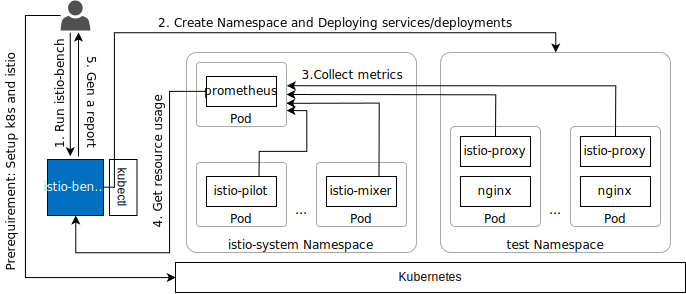

# istio-bench

A benchmark tool for [Istio](https://github.com/istio/istio). It measures CPU, Memory, Network usage of istio-proxies and istio control planes per number of pod.

This script will repeat deploying dummy pods and collect the usage of resources. Then it will calculate an approximate curve for resource usage and output csv tables and charts. Its architecture is shown as follows.



## Prerequirements

- in local machine
    - Python >= 3.5.0
    - pip
    - kubectl >= 1.9.0
- in remote cluster
    - Kubernetes Cluster >= 1.9.0 (enough compute resources are recommended)
    - Istio > 1.2, < 1.5 installed in istio-system Namespace
    - Prometheus installed in istio-system Namespace

## Get Started

Install istio-bench

```sh
git clone <this repository>
pip install -r requirements.txt
```

And run it

```sh
./istio-bench.py
```

## Command line arguments

```sh
  -h, --help            show this help message and exit
  --max_pod MAX_POD     maximum number of pods used in the test (default: 500)
  --interval INTERVAL   number of pods to deploy at one time (default: 100)
  --prometheus_url PROMETHEUS_URL
                        url of prometheus. default url uses kubectl port-
                        forward automatically (default: http://127.0.0.1:9090)
  --manifest MANIFEST   manifest filepath of dummmy pods
                         (default: ./template/nginx.yaml)
  --ns_manifest NS_MANIFEST
                        manifest filepath of dummmy namespaces
                        (default: /template/namespace.yaml)
  --prefix PREFIX        prefix of pod and namespaces for test
                        (default: dummy-)
  --no-graph            do not output graph image(svg) (default: False)
  -o OUTPUT, --output OUTPUT
                        Path of the output directory (default: ./output-
                        istio[version]-[timestamp])
  -v VERBOSE, --verbose VERBOSE
                        increase output verbosity[-2 < x < 2] (default: 0)
  --version             get version (default: False)
```

## Examples for usage and output

Measure the transition of resource usage when deploying 250 dummy pods step by step by 50 pods.

```sh
./istio-bench.py --max_pod 250 --interval 50
```

[Here](./output_sample/report.md) is the output.

## Why istio-bench

In some cases, the usage of resource in Proxy and ControlPlane increases linearly with the number of pods in the cluster. Therefore, it is necessary to manage the capacity well to prevent stopping of Pod and Node because of OOM Killer. Those tendency of the resource usage is different depending on Istio versions and cluster settings. So, it is effective to estimate the resource consumption according to the number of pods using a benchmarker.

## Contributing

TBD

## Authors

- **Ide, Takaya** - Hitachi Ltd.
- **Yu, Jiye** - Hitachi Ltd.
- **Namanuma, Yuki** - Hitachi Ltd.
- **Hatasaki, Keisuke** - Hitachi Ltd.

## License

Copyright 2020 Istio-Bench Authors and Hitachi Ltd.

Licensed under the Apache License, Version 2.0 (the "[License](./LICENSE)"); you may not use this file except in compliance with the License. You may obtain a copy of the License at

    http://www.apache.org/licenses/LICENSE-2.0
