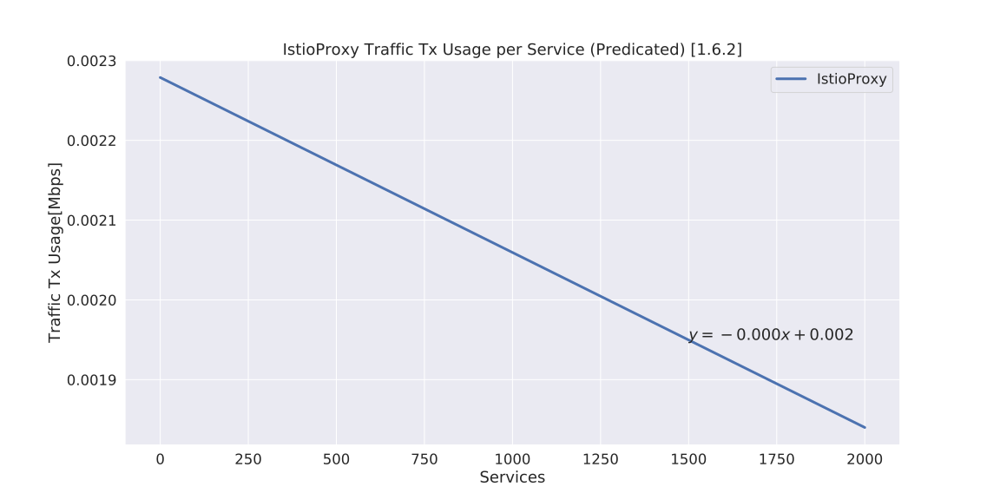
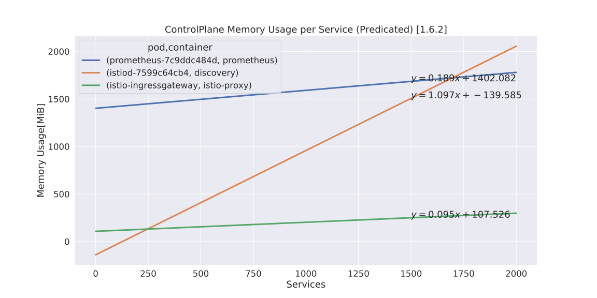
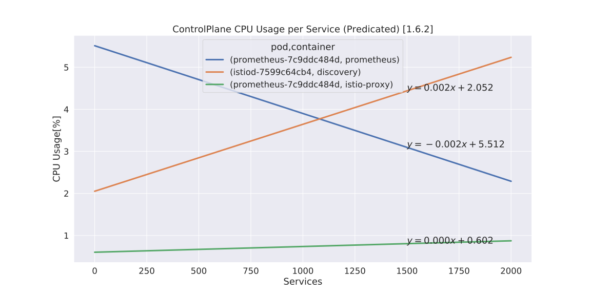
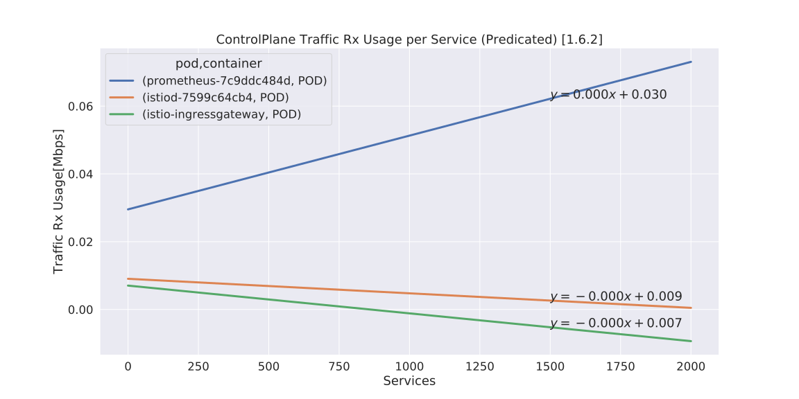

# Istio Resource Usage

- Date & Time: 03/08/2020, 17:38:34
- Istio: 1.5.0

## Istio Proxy

### Memory

### CPU

### Traffic RX

### Traffic TX

## ControlPlane (Top3)

### Memory

### CPU

### Traffic RX

### Traffic TX

## Raw charts

Charts

- Istio-Proxy
    - [Memory](./chart_istioproxy_memory.svg)
    - [CPU](./chart_istioproxy_cpu.svg)
    - [Traffic RX](./chart_istioproxy_traffic_rx.svg)
    - [Traffic TX](./chart_istioproxy_traffic_tx.svg)
- Control Plane
    - [Memory](./chart_controlplane_memory.svg)
    - [CPU](./chart_controlplane_cpu.svg)
    - [Traffic RX](./chart_controlplane_traffic_rx.svg)
    - [Traffic TX](./chart_controlplane_traffic_tx.svg)

## CSV Data

Predicated

- Istio-Proxy
    - [Memory](./table_istioproxy_memory.csv)
    - [CPU](./table_istioproxy_cpu.csv)
    - [Traffic RX](./table_istioproxy_traffic_rx.csv)
    - [Traffic TX](./table_istioproxy_traffic_tx.csv)
- Control Plane
    - [Memory](./table_controlplane_memory.csv)
    - [CPU](./table_controlplane_cpu.csv)
    - [Traffic RX](./table_controlplane_traffic_rx.csv)
    - [Traffic TX](./table_controlplane_traffic_tx.csv)

Raw Data

- Istio-Proxy
    - [istioproxy-0050pod.csv](istioproxy-0050pod.csv)
    - [istioproxy-0100pod.csv](istioproxy-0100pod.csv)
    - [istioproxy-0150pod.csv](istioproxy-0150pod.csv)
    - [istioproxy-0200pod.csv](istioproxy-0200pod.csv)
    - [istioproxy-0250pod.csv](istioproxy-0250pod.csv)
    - [istioproxy-0300pod.csv](istioproxy-0300pod.csv)
    - [istioproxy-0350pod.csv](istioproxy-0350pod.csv)
    - [istioproxy-0400pod.csv](istioproxy-0400pod.csv)
- ControlPlane
    - [controlplane-0050pod.csv](controlplane-0050pod.csv)
    - [controlplane-0100pod.csv](controlplane-0100pod.csv)
    - [controlplane-0150pod.csv](controlplane-0150pod.csv)
    - [controlplane-0200pod.csv](controlplane-0200pod.csv)
    - [controlplane-0250pod.csv](controlplane-0250pod.csv)
    - [controlplane-0300pod.csv](controlplane-0300pod.csv)
    - [controlplane-0350pod.csv](controlplane-0350pod.csv)
    - [controlplane-0400pod.csv](controlplane-0400pod.csv)
