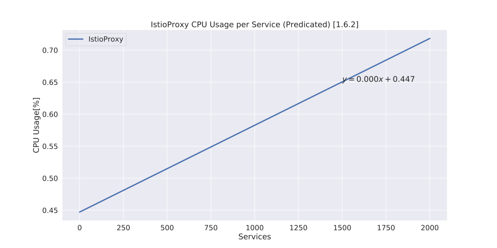
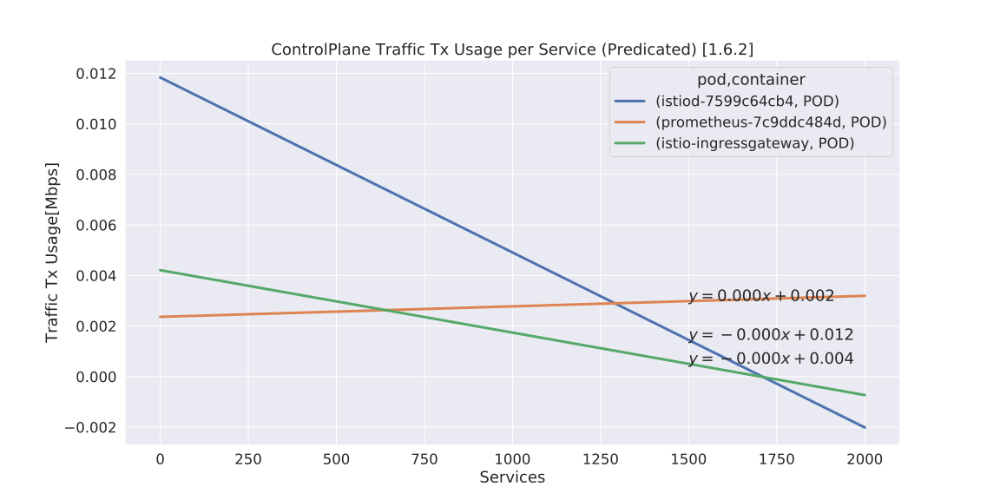

# Istio Resource Usage

- Date & Time: 06/17/2020, 04:36:39
- Istio: 1.6.2

## Istio Proxy

### Memory

### CPU

### Traffic RX

### Traffic TX

## ControlPlane (Top3)

### Memory

### CPU

### Traffic RX

### Traffic TX

## Raw charts

Charts

- Istio-Proxy
    - [Memory](./chart_istioproxy_memory.svg)
    - [CPU](./chart_istioproxy_cpu.svg)
    - [Traffic RX](./chart_istioproxy_traffic_rx.svg)
    - [Traffic TX](./chart_istioproxy_traffic_tx.svg)
- Control Plane
    - [Memory](./chart_controlplane_memory.svg)
    - [CPU](./chart_controlplane_cpu.svg)
    - [Traffic RX](./chart_controlplane_traffic_rx.svg)
    - [Traffic TX](./chart_controlplane_traffic_tx.svg)

## CSV Data

Predicated

- Istio-Proxy
    - [Memory](./table_istioproxy_memory.csv)
    - [CPU](./table_istioproxy_cpu.csv)
    - [Traffic RX](./table_istioproxy_traffic_rx.csv)
    - [Traffic TX](./table_istioproxy_traffic_tx.csv)
- Control Plane
    - [Memory](./table_controlplane_memory.csv)
    - [CPU](./table_controlplane_cpu.csv)
    - [Traffic RX](./table_controlplane_traffic_rx.csv)
    - [Traffic TX](./table_controlplane_traffic_tx.csv)

Raw Data

- Istio-Proxy
    - [istioproxy-0100svc.csv](istioproxy-0100svc.csv)
    - [istioproxy-0200svc.csv](istioproxy-0200svc.csv)
    - [istioproxy-0300svc.csv](istioproxy-0300svc.csv)
    - [istioproxy-0400svc.csv](istioproxy-0400svc.csv)
    - [istioproxy-0500svc.csv](istioproxy-0500svc.csv)
    - [istioproxy-0600svc.csv](istioproxy-0600svc.csv)
    - [istioproxy-0700svc.csv](istioproxy-0700svc.csv)
    - [istioproxy-0800svc.csv](istioproxy-0800svc.csv)
    - [istioproxy-0900svc.csv](istioproxy-0900svc.csv)
    - [istioproxy-1000svc.csv](istioproxy-1000svc.csv)
- ControlPlane
    - [controlplane-0100svc.csv](controlplane-0100svc.csv)
    - [controlplane-0200svc.csv](controlplane-0200svc.csv)
    - [controlplane-0300svc.csv](controlplane-0300svc.csv)
    - [controlplane-0400svc.csv](controlplane-0400svc.csv)
    - [controlplane-0500svc.csv](controlplane-0500svc.csv)
    - [controlplane-0600svc.csv](controlplane-0600svc.csv)
    - [controlplane-0700svc.csv](controlplane-0700svc.csv)
    - [controlplane-0800svc.csv](controlplane-0800svc.csv)
    - [controlplane-0900svc.csv](controlplane-0900svc.csv)
    - [controlplane-1000svc.csv](controlplane-1000svc.csv)
